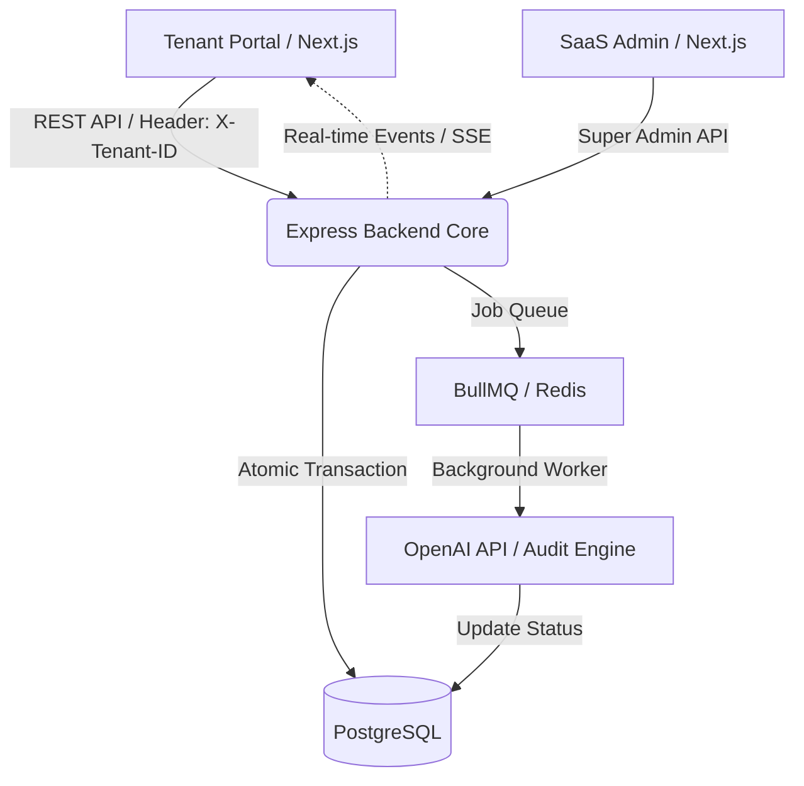

# AIBill-Core: Enterprise-Grade AI-Powered Financial Auditing SaaS

A highly scalable, multi-tenant SaaS application designed for automated financial auditing and ledger tracking. Built using a robust, backend-focused architecture that guarantees data isolation, transactional consistency, real-time asynchronous compliance processing, and high-performance analytical retrieval.

## 🏛️ System Architecture



## ✨ Core Engineering Highlights

*   **Multi-Tenant Data Isolation:** Secured via Custom Express Middleware running strict header-based context switching (`X-Tenant-ID`) to guarantee total tenant boundaries.
*   **Immutable Double-Entry Ledger:** Financial transactions engineered through strict relational database logic (Prisma Client Transactions) ensuring zero historical data tampering and automatic void reversals.
*   **Asynchronous AI Processing:** Time-consuming OpenAI compliance scanning offloaded to a non-blocking background job queue layer powered by **BullMQ & Redis**.
*   **Low-Latency Aggregations:** Tenant dashboards optimized using a tactical **Redis Caching Strategy** with aggressive cache invalidations triggered on write events.
*   **Path-Based Conditional CI/CD:** Monorepo architecture integrated with distinct GitHub Actions pipelines to deploy modifications *only* to the changed service, saving server resources and deployment overhead.

## 🛠️ Tech Stack & Monorepo Structure

*   **Monorepo Strategy:** Workspace layout dividing components cleanly.
*   **Backend Engine:** Node.js, Express, TypeScript, Prisma ORM, BullMQ, Redis, PostgreSQL, OpenAI SDK.
*   **Frontend Applications:** Next.js (App Router), Tailwind CSS, State Management.
*   **DevOps & Infrastructure:** Docker & Docker-Compose, Linux/VPS, Nginx Reverse Proxy, GitHub Actions.

```text
aibill-enterprise-saas/
├── apps/
│   ├── backend/               # Node.js + Express + TypeScript Core Engine
│   ├── saas-admin/            # Next.js Dashboard for Super Admin (Tenant management)
│   └── tenant-portal/         # Next.js Dashboard for Tenant Users (Invoices, Reports, AI Audit)
├── Dockerfile.backend
├── docker-compose.yml
└── .github/workflows/         # Path-Based Automated Deployment Workflows
```

## 🚀 Getting Started (Local Setup)

### Prerequisites
Make sure you have **Docker** and **Docker-Compose** installed on your system.

### Installation
1. Clone the repository:
   ```bash
   git clone https://github.com/nazmul-devs/aibill-enterprise-saas
   cd aibill-enterprise-saas
   ```

2. Create a `.env` file inside the `apps/backend/` directory and populate your OpenAI secret token:
   ```env
   OPENAI_API_KEY=your_openai_api_key_here
   ```

3. Spin up the entire infrastructure with a single command:
   ```bash
   docker compose up -d --build
   ```

### Application Endpoints
Once the containers are live, the network exposes the following channels:
*   **Express Backend Core Engine:** `http://localhost:5000`
*   **Tenant Client Portal (Next.js):** `http://localhost:3000`
*   **SaaS Super Admin Panel (Next.js):** `http://localhost:3001`
*   **PostgreSQL Instance:** `localhost:5432`
*   **Redis Cache Memory:** `localhost:6379`

## 📑 Core API Contract Highlights

### Super Admin Channel
*   `POST /api/v1/admin/tenants` - Registers a new corporate business entity (Tenant).

### Tenant Invoicing & Ledgers (Protected via `X-Tenant-ID`)
*   `POST /api/v1/invoices` - Stores invoice entities, maps immutable double-entry records, and kicks off async AI audit queues.
*   `PATCH /api/v1/invoices/:id/status` - Switches statuses (`VOID` status automatically fires a strategic balance reversal logic in ledgers).
*   `GET /api/v1/dashboard/summary` - Pulls highly optimized metrics straight from Redis cache.
*   `GET /api/v1/reports/journal` - Fetches chronological statements optimized with database composite indices.
*   `GET /api/v1/notifications/stream` - Initiates Server-Sent Events (SSE) to push instant client notifications upon AI workflow conclusions.
